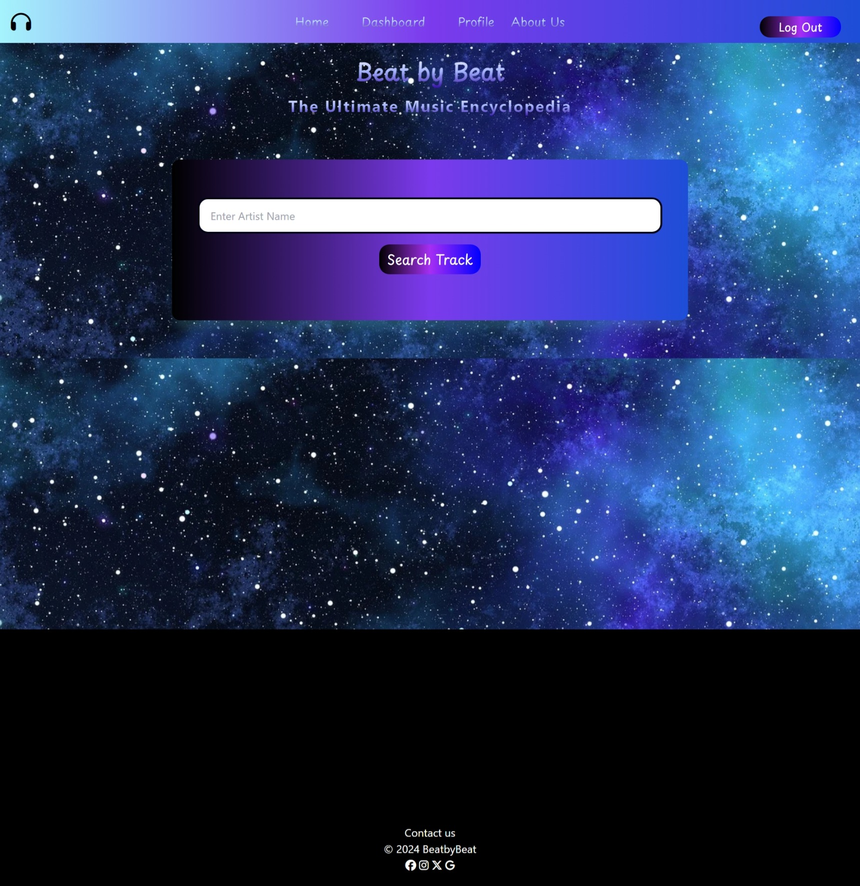

# Beat-by-Beat

Beat By Beat is a user-friendly web application designed to cater to music enthusiasts seeking comprehensive information about their favorite artists and their music videos. Users can effortlessly search for artists and access detailed profiles fetched from the AudioDB API, including biographies, discographies, captivating images, and music videos. Additionally, Beat By Beat encourages social interaction by enabling users to like artists and connect with friends within the platform, fostering a vibrant community of music lovers.




## Installation

1. Clone this repository:
```bash
git clone git@github.com:charleswt/beat-by-beat.git
```
2. Navigate to the project root directory & install dependencies:
```bash
npm install
```
3. Set up a MySQL database and configure the connection in ./config/connection.js.

4. Create a .env file and add necessary environment variables, including the API key for the AudioDB API.

5. Run the command and then open local hosdt on your browser:
```bash
npm start
```

### Usage

You can use the deplyoed site at [BeatbyBeat](https://beatbybeatv2-d6c2b024a00e.herokuapp.com/login)

- **Login or Sign up**: Create an account to access BeatbyBeat
- **Search Artist**: Using the Search bar on the home page you can search for your favrotie artsits
- **Favorite Artists**: Using the Profile tab you can easily see your favorties Artists
- **Find and Add Friends**: Using the dashboard tab you can search for friends and add them


 ## Technologies Used

- Tailwind CSS
- Node.js: Backend runtime environment for executing JavaScript code.
- Express.js: Web application framework for building server-side functionality.
- Handlebars.js: Templating engine for generating dynamic HTML content.
- Sequelize: ORM (Object-Relational Mapping) for interacting with the database.
- MySQL: Database management system for storing user and artist data.
- Fetch API: Used to make HTTP requests to external APIs such as the AudioDB and MusicBrainz APIs.
- Crypto: Utilized for generating secure session secrets.
- dotenv: Environment variable management for storing sensitive information.
- express-session: Middleware for managing user sessions.
- connect-session-sequelize: Session store for storing session data in the database.

## Contributors

Judith Hernandez - @judy-her
Robert Solorzano - @robertsolorzano
Lucy Jihyeon Kwon - @lucyJihyeon
Charles Tiffany - charleswt
Harika Patha - Harikapatha


## Source Code Repository

@judy-her
[Beat-by-Beat-1.0](https://github.com/judy-her/beat-by-beat)

@lucyJihyeon[404-ping-pong](https://github.com/lucyJihyeon/404-ping-pong)
- Note that this project is inspired by the tutorial "Create the Pong Game in JavaScript" by CodeOne. The video provided a solid foundation and understanding of the core concepts required to develop a Pong game using JavaScript.


